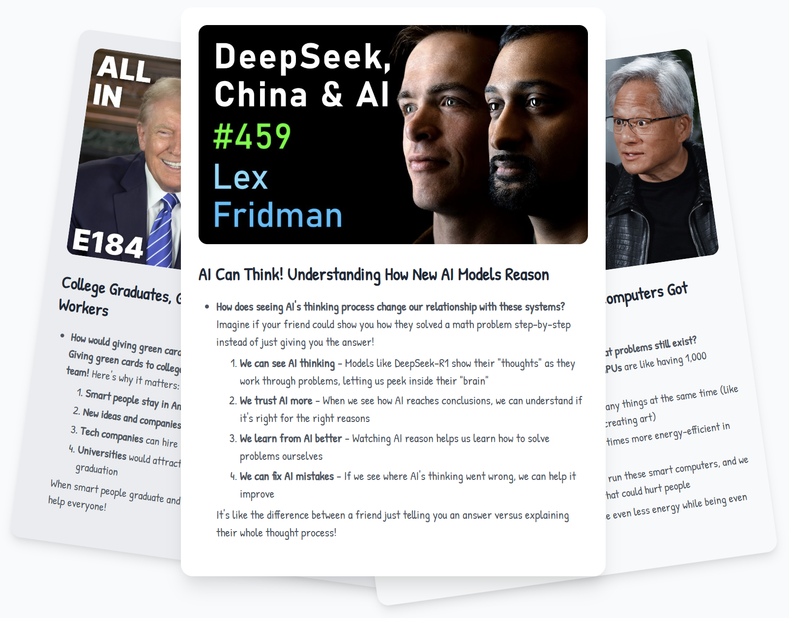

<h1 align="center">Create youtube Blog in Few seconds</h1>


Have a 5-hour YouTube video but no time to watch it? This LLM application pulls the main topics and creates you a blog and lets you download html file.
<div align="center">
  
</div>

Design Doc: [docs/design.md](docs/design.md), Flow Source Code: [app.py](app.py)


## How to Run

1. Specify your google gen-ai API key

2. Install the dependencies and run the program:
```bash
pip install -r requirements.txt
streamlit run app.py
```

3. When it’s done, youll get  download button  to  download andsee the results.


